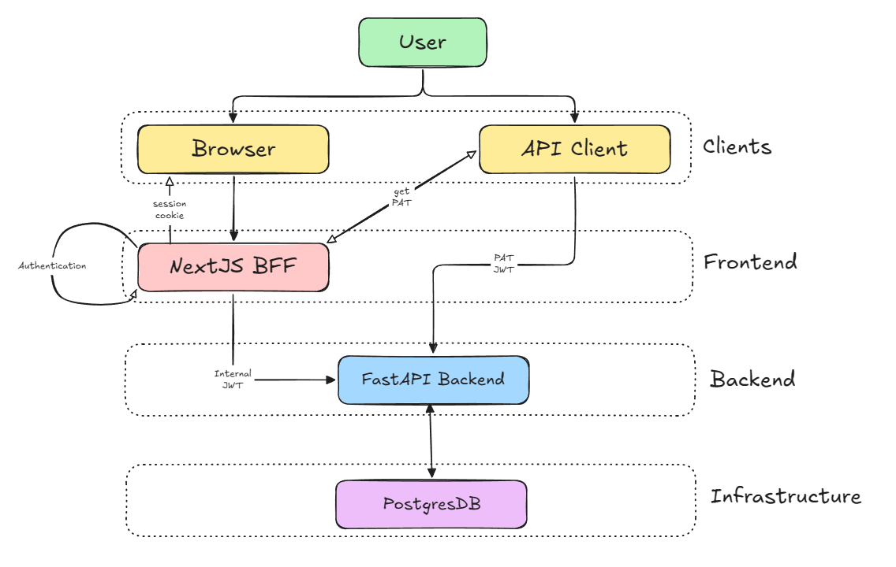

# High Level Architecture
This document defines the high level architecture of Xenon.

### Clients
Clients are various ways in which a user can access the application. Examples: Browser, any API Client (cURL, Postman, etc)

### Frontend
We're adopting a BFF (Backend for Frontend) architecture for this application. The frontend is responsible for **authentication** of the user when accessed via the Browser.

A user logs in via the UI and authenticates. On successful login, the BFF sets a Session Cookie in the browser.

Now, the Frontend communicates with the Backend via a special Internal JWT that is handled via the BFF itself.

### Backend
The FastAPI Backend is never exposed to the general Internet. The Backend assumes that all requests coming to it are already **authenticated**.

The common language to communicate with the backend is a fixed schema JWT Token. This JWT contains the user details that the backend uses to authorize the requests.

For accessing the endpoints directly, the user requires a PAT Token that can be sent as a Bearer JWT in each request. This PAT can be created and managed via the UI.

### Infrastructure
#### 1. PostgresDB
The main Relational Database used by Xenon for storing User Data.