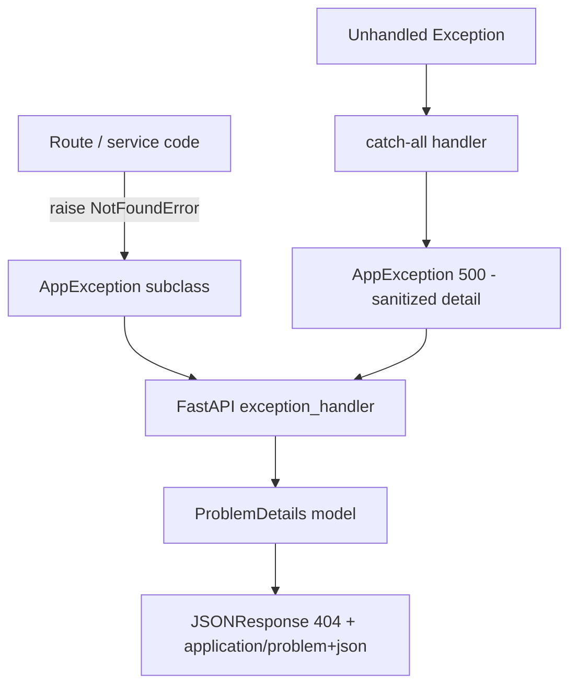

# Xenon Project Notes

### Docstring Format

It is mandatory to add a proper docstring at:

- Module Level (Top of File)
- Functions
- Classes

In this project, we're going ahead with Google-Styled Docstrings:

```python
"""
<One-line summary of the module's responsibility>.

<Optional extended description: key concepts, how it fits in the app, important dependencies or side effects. 1–3 sentences max unless warranted.>
"""
```

```python
def fn(arg: str, *, flag: bool = False) -> ReturnType:
    """
    <Imperative summary>

    <Optional extended description.>

    Args:
        arg: <What it represents, constraints, valid values.>
        flag: <What it controls.>

    Returns:
        <What is returned and when.>

    Raises:
        <ExceptionType>: <When/why.>

    Yields:
        <For generators/async generators — what each iteration produces.>
    """
```

```python
class MyClass:
    """
    <One-line summary of what this type represents or does>.

    <Optional extended description.>

    Attributes:
        field_name: <Meaning, not just the type.>

    Note:
        <Important behaviour, invariants, or side effects.>
    """
```


## Exception Handling
Following the RFC 9457 Problem Details format for reporting Exceptions



1. Raise domain exceptions in business logic — routes and services raise typed subclasses (NotFoundError, etc.), not raw HTTPException or bare Exception.
2. Base class carries HTTP semantics (base.py) — each exception knows its status_code, title, type_uri, detail, and optional extensions.
3. RFC 9457 serializer (problem_detail.py) — a Pydantic model (ProblemDetail) maps those fields to the standard JSON shape.
4. Global handlers in main.py — FastAPI @app.exception_handler(...) functions catch exception types and return consistent application/problem+json responses.

RFC 9457 core fields:

|Field|	Purpose|
|---|---|
|type|URI identifying the problem category (default about:blank)|
|title|Short, stable summary (e.g. "Resource Not Found")|
|status|HTTP status code (must match response status)|
|detail|Occurrence-specific explanation|
|instance|URI of this specific request (usually request.url)|

Extension members are extra top-level keys in the same JSON object.